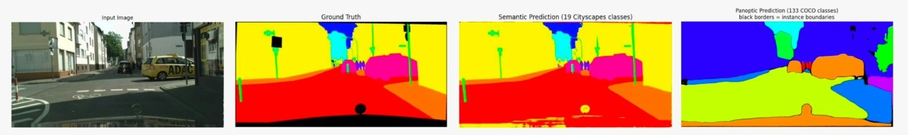

# Comprehensive Road Scene Understanding for Autonomous Driving

Joint **semantic segmentation** and **open-world anomaly detection** for autonomous driving, comparing a pixel-level CNN baseline (ERFNet) against a transformer mask-based model (**EoMT** — Encoder-only Mask Transformer), fine-tuned from COCO to Cityscapes via **Layer-wise Learning Rate Decay (LLRD)**.

> University course project (Politecnico di Torino). Team: Andrea Nardo, Flavio Frasca, Francesca Longo, Giuditta Macigno.
> This is a cleaned-up, standalone copy of our shared team repository, reorganized for external presentation — see [Provenance & attribution](#provenance--attribution) below for exactly which parts are the team's own work vs. third-party code we built on.

📄 **[Read the full report (PDF)](paper/report.pdf)** — theory, methodology, and complete results.

<p align="center">
  
</p>

## Project overview

Most semantic segmentation models assume a **closed set** of classes and produce overconfident predictions when they encounter something unexpected — a serious problem for autonomous driving, where unfamiliar objects appear constantly. This project:

1. Adapts a **COCO-pretrained EoMT** model to **Cityscapes** through label remapping (zero-shot) and LLRD fine-tuning (four phases: frozen backbone → progressive unfreezing with γ = 0.3, 0.6, 0.8).
2. Compares four segmentation models — **ERFNet**, **EoMT (COCO, zero-shot)**, **EoMT (Cityscapes)**, and **EoMT (fine-tuned, ours)** — on closed-set semantic segmentation.
3. Evaluates **four post-hoc anomaly scoring methods** (MSP, MaxLogit, MaxEntropy, and mask-based **RbA**) on five anomaly benchmarks, plus the effect of **temperature scaling** on MSP.

## Key results

**Semantic segmentation (Cityscapes val, mIoU):**

| Model | mIoU (%) | Notes |
|---|---|---|
| ERFNet (pixel baseline) | 72.2 | Standard convolutional architecture |
| EoMT (COCO, zero-shot) | 55.1 | Taxonomy mapping, no fine-tuning |
| **EoMT (fine-tuned, ours)** | **79.8** | LLRD adaptation, γ = 0.6 |
| EoMT (Cityscapes, upper bound) | 81.7 | Fully specialized reference |

**Anomaly segmentation highlights (AuPRC ↑ / FPR95 ↓):** our fine-tuned model's mask-based **RbA** scoring reaches **94.00% / 0.43%** on SMIYC RO-21 and **85.18% / 5.50%** on Fishyscapes Static — outperforming ERFNet on every benchmark tested. Region-level scoring (RbA) consistently produces more coherent anomaly maps than pixel-wise measures; **MaxEntropy** is the most stable pixel-wise method across all checkpoints. Temperature scaling on MSP gives only marginal gains (≤ +0.14 AuPRC) — full tables in the [report](paper/report.pdf).

## Repository structure

```
road-scene-segmentation-anomaly/
├── README.md, requirements.txt, .gitignore, LICENSE
│
├── paper/
│   ├── report.tex, biblio.bib, image.jpeg
│   └── report.pdf
│
├── results/figures/          → qualitative result images
├── data/README.md            → how to obtain Cityscapes / SMIYC / Fishyscapes / Road Anomaly
├── trained_models/           → ERFNet pretrained checkpoints (small, versioned directly)
│
├── eomt/                     → trimmed local copy of the official EoMT codebase (MIT, TU/e) +
│   │                            our own additions, kept in its original working directory
│   ├── models/, training/, datasets/, configs/, main.py    (upstream, unmodified)
│   ├── finetuning.ipynb, inference.ipynb                   (ours: LLRD fine-tuning + inference)
│   ├── eval_anomaly_eomt.py, eval_temperature_scaling.py   (ours: anomaly scoring pipeline)
│   └── pip_eval.py                                         (ours: fair mIoU comparison EoMT-COCO vs EoMT-Cityscapes)
│
└── eval/                     → course-provided ERFNet evaluation harness + our additions
    ├── erfnet.py, iouEval.py, dataset.py, transform.py, eval_iou.py, ...   (course-provided)
    └── eval_step7_erfnet.ipynb, eval_step8_eomt.ipynb                     (ours: evaluation pipeline)
```

## How to run it

```bash
# 1. Clone the repo
git clone <repo-url>
cd road-scene-segmentation-anomaly

# 2. Create an environment and install dependencies
python -m venv .venv
source .venv/bin/activate        # on Windows: .venv\Scripts\activate
pip install -r requirements.txt

# 3. Get the datasets and checkpoints (see data/README.md) and point to them
export MASKARCH_DATA_ROOT=/path/to/your/data

# 4. Run the anomaly evaluation, from the eomt/ directory
cd eomt
python eval_anomaly_eomt.py --model_type finetuned --method RbA
python eval_temperature_scaling.py --model_type cityscapes
```

Fine-tuning and inference are run interactively via `eomt/finetuning.ipynb` and `eomt/inference.ipynb`; the ERFNet baseline and full evaluation pipeline via the notebooks in `eval/`.

## Provenance & attribution

This project builds on two external codebases; **only the files listed below are the team's own contribution**:

- **[EoMT](https://github.com/tue-mps/eomt)** (Kerssies et al., CVPR 2025 Highlight) — Mobile Perception Systems Lab, TU Eindhoven, MIT License. We use it essentially unmodified (`eomt/models/`, `eomt/training/`, `eomt/datasets/`, `eomt/main.py`, `eomt/configs/`) and built on top of it: `finetuning.ipynb`, `inference.ipynb`, `eval_anomaly_eomt.py`, `eval_temperature_scaling.py`, `pip_eval.py`. Note: LLRD fine-tuning itself is a built-in feature of the upstream EoMT training code — our contribution here is applying and tuning it (γ sweep) for Cityscapes adaptation, not implementing LLRD from scratch.
- **ERFNet evaluation harness** (`eval/`, based on [erfnet_pytorch](https://github.com/Eromera/erfnet_pytorch), **CC BY-NC 4.0 — personal/research use only**) — provided as course starter code. Our additions: `eval_step7_erfnet.ipynb`, `eval_step8_eomt.ipynb`.
- `trained_models/` — official pretrained ERFNet weights.

The full, unedited shared team repository (including course starter material) remains at the link in the [paper](paper/report.pdf)'s abstract.

## Tech stack

Python · PyTorch · PyTorch Lightning · Hugging Face Transformers · scikit-learn · DINOv2 (EoMT backbone) · LaTeX
